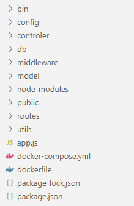
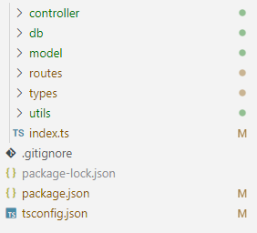
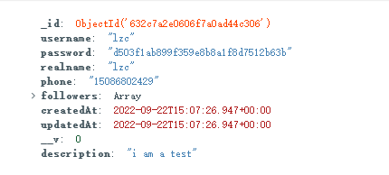
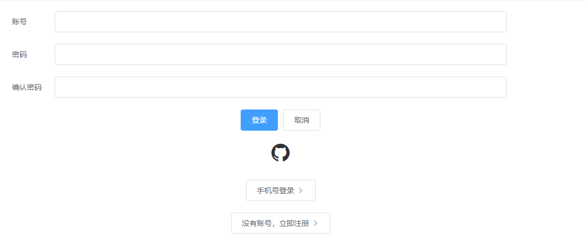
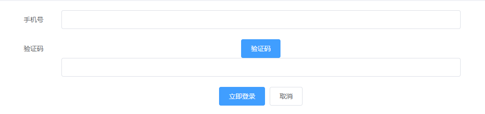
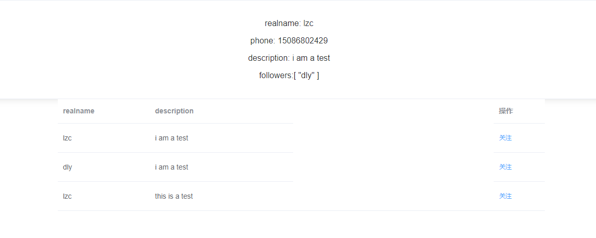
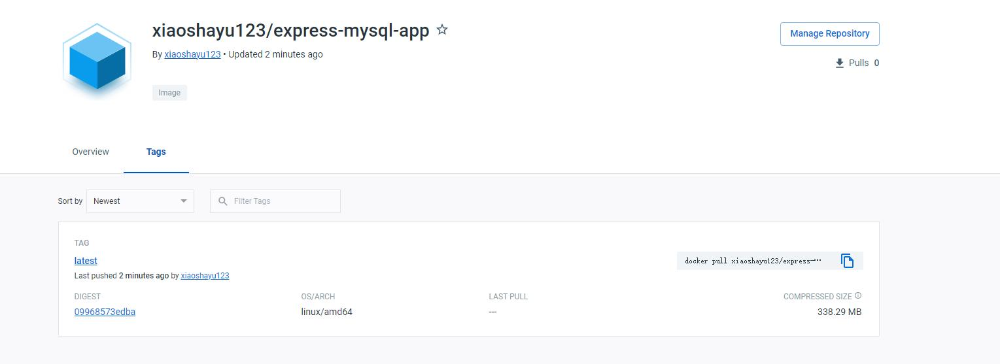
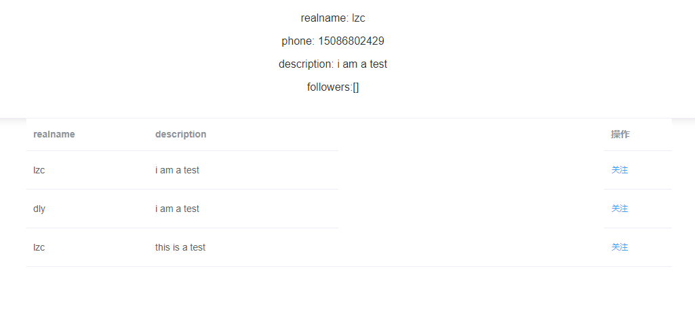
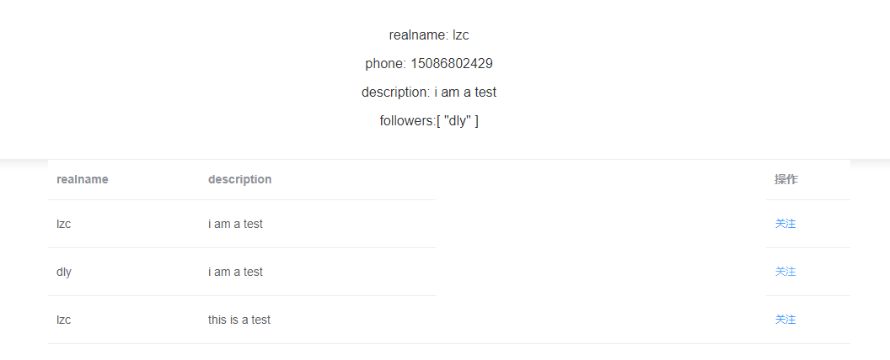

#笔试

## 1.笔试情况简介
针对于本次笔试，设计了两套方案。一套是express+mysql+js,一套是koa+mongodb+ts。设计了三种登陆方式，分为账号密码登录，手机号验证登录，第三方github登录。使用session和redis进行权限校验。安全性考虑，针对常见的网络攻击如xss和sql注入进行了后端的预防，同时对密码使用md5加密，防止信息泄露的同时明文展示密码。为了方便测试，使用vue2+elementUI搭建了一个简单的小项目。

## 2.指标情况

1. User Registration ✔
2. Get user info ✔
3. User Login ✔
4. Follow a user ✔
5. Use GraphQL instead of RESTful ×
6. Add a database ✔
7. Docker it！ ✔

## 3.详细方案介绍

### 1.项目结构

#### 1.express

 1. config文件夹:里面主要是对数据库配置的信息文还有阿里短信服务相关的配置信息
 2. db文件夹 里面主要是mysql的连接以及查询函数exec的封装，还有redis的连接文件
 3. model文件夹，里面是返回数据的格式封装了一个class，数据返回统一按照里面的successModel和ErrorModel返回。
 4. utils文件夹 utils文件夹主要存储了密码加密相关逻辑并把加密密码的函数导出
 5. controller文件夹 controller文件夹里有一个user文件，里面主要是定义了所有与数据库交互的函数
 6. routers文件夹 存储user路由信息的文件夹，网络请求会按照里面的路由被对应的路由函数所处理。
 7. middleWare文件夹 放中间件的地方，封装了一个logincheck函数，对判断用户是否登录。

#### 2.koa

1. db文件夹里面主要是mongodb相关的配置，有mongodb的连接文件，还有mongodb的schema
2. utils文件夹 utils文件夹主要存储了密码加密相关逻辑并把加密密码的函数导出
3. controller文件夹 controller文件夹里有一个user文件，里面主要是定义了所有与数据库交互的函数
4. model文件夹 里面是返回数据的格式封装了一个class，数据返回统一按照里面的successModel和ErrorModel返回。
5. types文件夹 types文件夹主要存储了ts中用到的interface，比如用户的信息
6. routers文件夹 存储user路由信息的文件夹，网络请求会按照里面的路由被对应的路由函数所处理。

### 2.数据库设计
用户的信息主要包括以下信息
username:登录用户名
password:登录密码
phone:登录手机号
realname:真实姓名
description:个人简介
followers:关注列表
#### 1.mysql
mysql中主要有两个表，一个表是user表，用来存储注册后的用户信息，另一个表是followers表，用来存储关注者的信息。

用户表结构

关注者表结构
#### 2.mongodb
mongodb中只有一个集合，分别把数据都存在这个集合里，followers以数组的方式存储。

mongodb数据示例

### 3.注册功能设计
注册功能填写的信息如下

注册功能需要用户填完手机号之后点击验证码，后台会随机生成六位验证码，向阿里云发送请求，阿里云会发送信息到用户手机中，同时后端会将验证码保存到redis中，等到用户注册填完所有信息注册的时候校验，接口会把验证码传递会前端，前端也可以通过验证码进行验证。

#### 接口路由:
1. 发送验证码 '/api/user/sendSmsCodeToUser'
2. 注册: '/api/user/register'

### 4.登录功能设计
#### 1.账号密码登录

后台控制的登录接口有两个，一个是login
控制的是账号密码登录还有短信验证登录，另一个是github相关的三个接口，控制的是github登录。
用户发送请求到后台，请求中有一个type属性，在login中会判断它是不是username，是的话则为账号密码登录，查询数据库中是否有这条信息，如果有的话则登陆成功。

#### 2.手机号验证登录

跟注册一样，用户填完手机号后点击验证码会发送验证码到手机里，同时后台将验证码存在redis中。用户发送请求到后台，请求中的type为phone则是验证码登录，先检查验证码是否一致，一致的话通过phone去查找数据库，如果存在数据则登录成功。

#### 3.github登录

github登录主要采用的是oauth授权登录，首先用户点击图标，会发送网络请求到后台，后台会组装一个新的url返回给前端，前端通过window.location.href，向这个新的网站发送请求，新网站会弹出github登录和授权界面，授权成功之后github会去向在github中绑定的callback进行请求，同时携带授权的requestToken，后台收到请求之后会携带它向github发送请求获取responseToken，获取成功之后会把它传递给前端同时重定向到github页面，github页面在created阶段会通过这个responseToken向后端发送请求，后端会通过这个responseToken向github发送请求获取到用户的信息，如果它是一条新的数据那么就插入到数据库中，反之为了保证数据字段的一致性，把数据库中的数据返回。

#### 4.登录相关路由
 1. 账号密码和手机号验证登录路由 '/api/user/login'
 2. github登录获取requestToken网址的路由 '/api/auth/github'
 3. github登录返回responseToken的路由 '/api/user/auth/github/callback'
 4. github登录 从github获取用户信息的路由 '/api/user/auth/github/getData'

### 5.获取用户信息功能
获取用户信息主要有两个接口，一个接口是获取个人信息，另一个接口是获取全部信息，获取全部信息主要是为了关注功能，我是在主界面created阶段获取全部用户信息然后展示在列表里，列表有关注按钮，用户点击它之后就可以关注。
对于mysql来说，先在user表中查到个人信息，然后再去followers表中查询相关的数据把它们放到user数据中的followers属性中，对于mongodb来说，由于数据就是存储在followers中所以无需进行额外处理。

#### 1.登录相关的接口
 1. 获取个人信息  '/api/user/getInfo'
 2. 获取全部用户信息 '/api/user/getAllInfo'

### 5.关注功能
在页面点击关注之后会调用后端的接口把用户的信息添加到对应的数据库中，实现关注功能。

#### 1.关注相关的接口
 1. 添加关注者 'api/user/addFollower'

### 6.安全相关
1. sql注入
对于mysql中主要是防止sql注入。使用了mysql提供的escape函数对sql语句中用到的字段数据进行包裹，内部主要是对输入信息中的引号进行转义。

2. xss攻击
对于descrption字段而言，由于内容可能会很长，所以需要预防xss攻击，使用了xss库，对于description数据外层用xss函数进行了包裹，内部是对descripton中的左括号和右括号进行了转移，防止script脚本暴漏信息。

3. 密码加密

为了防止密码泄露，使用md5对密码进行加密，数据库中存的是加密后的字符串，这样即使信息泄露密码也不会泄露。使用crypto库封装了一个genPassword库，返回加密后的密码。

### 7.docker
主要是把express项目创建了docker，并上传到了仓库里。

## 4.测试介绍

1. npm install 安装后端项目依赖 yarn install/npm install安装前端依赖
2. npm run dev启动前端项目
3. 跳到login界面 点击注册按钮

4.输入完全部信息之后点击验证码按钮，将手机收到的验证码输入到验证码框中
5.点击立即注册弹出注册成功即为成功
6.可以选择账号密码登录也可以选择手机号登录，登录之后跳转到首页可以看到个人信息以及下方全部信息

7.对于下方用户点击关注之后，上方用户信息followers中会多出一条信息，即为关注成功。

## 5.总结
在本次的笔试中，有很多的东西是我之前没有接触到和接触的比较少的，docker和graphQL之前没怎么接触，最后还是把docker跑通了，收获了很多，这期间遇到了各种各样的bug最后也将大部分都解决掉了。有一些点还可以再优化一下。

### 待优化的点
1.功能上来说，只有添加关注者的功能，后续可以添加更多的功能，例如查看关注者信息，取关等等。

2.登录方式还有其他的方式可以实现，比如扫描登录，以及其他第三方登录，扫码登录我的思路是，二维码里面是一个路由信息，扫码之后用户把相关信息填进去，之后会向后端传递信息，后端确认信息是否正确，同时如果是第一次扫码将信息存储到数据库中，然后前端的话可以通过websocket或者是轮询的方式发送api查询后端的状态，如果后端已经处理完本次扫码登录信息则前端获取信息之后开启登录的逻辑。

3.短信验证是用的阿里云个人短信验证，可以发送短信的手机号必须再阿里云上填写，所以不方便其他人去测试短信。在代码里我也有不去发送短信直接返回生成的验证码的逻辑，方便测试。

4.mysql相关的查询还可以优化，mysql的关注者我是存的另外一张表，另外一张表中的数据是用户的全部信息，用户的其他信息在主表中是存在的，同时查询到用户之后我还会再进一步去查followers表，把数据取出，两次查询也可以用sql优化成一句查询，这两点可以再优化，同时为了优化速度，如果数据量小的情况下，也可以将数据存储在redis中，这样查询是直接查内存而不是去查磁盘，速度快。

5.对于前面展示的全部用户信息，如果用户数量过多那么显示的效果就很差，可以使用分页来进行，请求API的时候加上offset和limit，这样每次点击下一页请求新的内容渲染到首页是比较好的一个手段。

6.对于ts而言，不太熟练，工作中主要还是使用js，所以本次koa项目中ts没有用到太多的特性，仅仅用到了ts的interface，以及class中的一些修饰符，后续需要再多写项目多加练习。

### 个人觉得比较好的点

1.登陆方式有三种，github登录和短信验证登录是我觉得比较好的点
2.项目结构比较分明，比较规范
3.关注到了安全性，对常见的web攻击以及密码加密进行了处理

